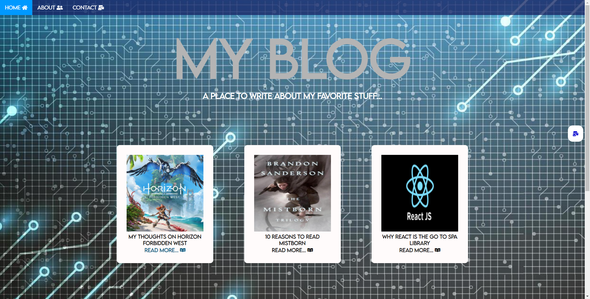
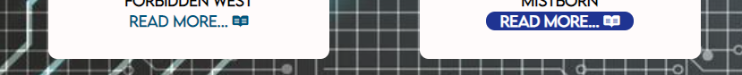
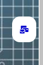

# Blog V2 Part 1.

Last time we worked with making a blog about things we liked, now we want to the same but with more style &#128526;. 

## Instructions
- Clone the repository to work locally.
- Work inside the `index.html` file and the `style.css` file for now. 
- With css change the font for the whole document. 
- Add a background image that you like. Make it so the image cover the whole page.
- Create a list with 3 list items: Home, About and Contact like the reference. Add an icon to each list item.
- Add the css style so the Navigation bar looks like the one in the reference. The important thing is to be have the navbar at the top and add some colors to it.
- Make every list item of the navbar a link, that will redirect the user to the `about.html` and `contact.html`.
- Add a div for the title of your blog like the in the reference image.
- Add a div for the content section. This part will contain all the small cards with the posts.
- Each card will have an image, a title and a link to read more.
- Add an icon to the link of the card
- Create minimum 6 cards.
- Use what you have learned from css so it looks similar the reference. Of course you can add your own style and change forms and colors &#129395;.

### Bonus!
Want more challenge? Then try to do these:
- Use css for making it so the navbar will stay at the top always even if we scroll.
- In `about.html` and `contact.html` add the same navbar as in the `index.html`. Change the `href` attribute as needed.  
- Create an active class. Use this class for represent in which page is the user currently.
- Add a contact button that will stay at the right side of the page, and keeps there even if we scroll the page. Add an icon to the button and when click should redirect you to `contact.html`
- For the links in the posts, change the color for the  visited links. When hovering the link, make it so the background and the color changes.

## References
### Main page

### link example

### Contact button example
